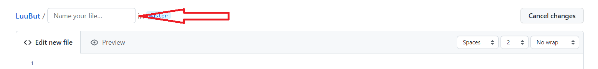
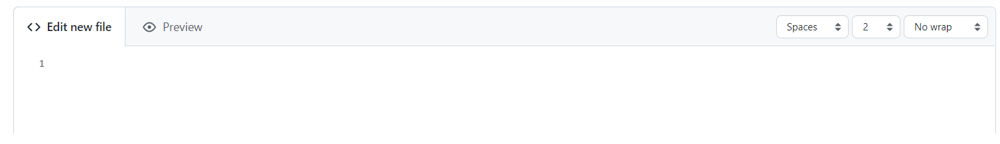
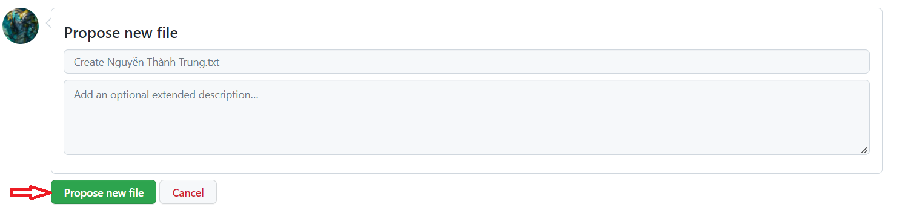
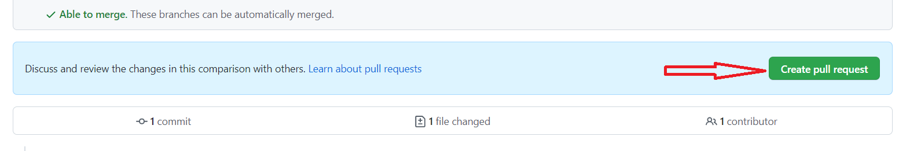
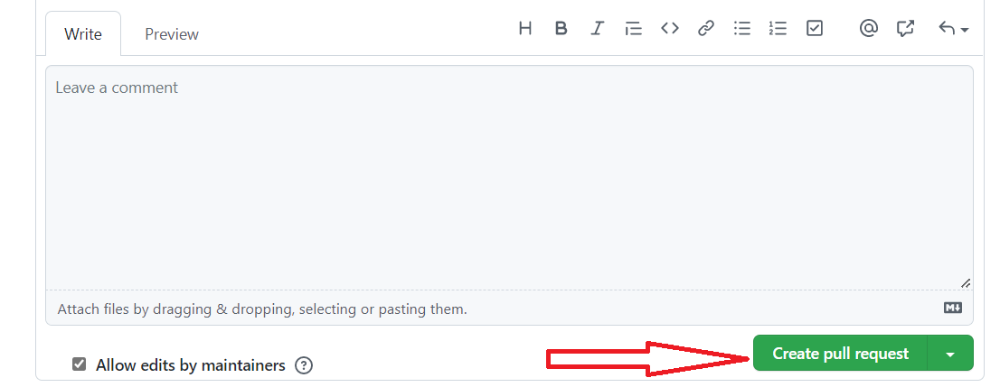

# Lưu bút online của Nguyễn Thành Trung

Viết vài dòng lưu bút gửi mình nhé! 🐧🐧🐧🐧

## Hướng dẫn

### Với các bạn đã biết dùng Git
Fork, clone, tạo một file mới (<Tên>.txt hoặc <Tên>.md hoặc <Tên>.png (tùy vào việc bạn viết chữ thương, viết Markdown hay chụp ảnh)), rồi mở pull request như mọi repo GitHub thông thường thôi. 🐧

### Với các bạn chưa biết dùng Git
**Bước 1**: Tạo một tài khoản GitHub (nếu bạn chưa có), tại [đây](https://github.com/join).  
**Bước 2**: Bấm vào link [này](https://github.com/trungnt2910/LuuBut/new/master) để tạo một file mới.  
**Bước 3**: Trong ô "Name your file..." viết <Tên của bạn>.txt (VD: Nguyễn Thành Trung.txt)

**Bước 4**: Trong vùng nhập nội dung file (Edit new file), viết vài lời của bạn nhé! (Không cần dài đâu!)  

**Bước 5**: Trong vùng ở dưới vùng nội dung file, (Propose new file), nhấn vào nút màu xanh ("Propose new file").  

**Bước 6**: Trong trang web tiếp theo, bấm vào "Create pull request".  

**Bước 7**: Ở trang cuối cùng, bấm vào "Create pull request" một lần nữa để gửi file lưu bút của bạn!  

## FAQ

**Q1**: Tại sao mày không làm cmn một cái link Google Forms mà lôi lên tận GitHub, lằng nhằng vl ra?  
**A1**: Một vài lý do:
- Trên GitHub làm mọi thứ cần tài khoản GitHub, các bạn viết tự động lưu luôn cả tên và thông tin liên lạc, sau này nếu có cơ hội chúng ta làm việc với nhau cho dễ.
- Chuyên Tin với nhau cả, viết cho nhau trên mạng xã hội GitHub với nhau cho "ngầu".
- Mấy cái sheet với forms, thậm chí là cả quyển lưu bút giấy, dễ thất lạc lắm. Còn tài khoản GitHub là sẽ đi theo cả sự nghiệp.
- Quy trình hơi dài chút, nhưng không mất quá nhiều thời gian, để tránh spam 🐧🐧🐧🐧.
